# JURO Architecture Diagrams

## Project Basics

- **Project name:** JURO
- **One-line description:** Java-only desktop study app for authoring coding problems, launching local editor scaffolds, running Java tests, evaluating verbal explanations with a local AI provider, and scheduling spaced repetition reviews.
- **Tech stack:** React 19, TypeScript, Vite, Tauri 2, Rust launcher, Java 17, Spring Boot 3.4, Spring Data JPA/Hibernate, Flyway, H2 desktop database, optional PostgreSQL default server profile, Zod, React Hook Form.

## Folder Structure

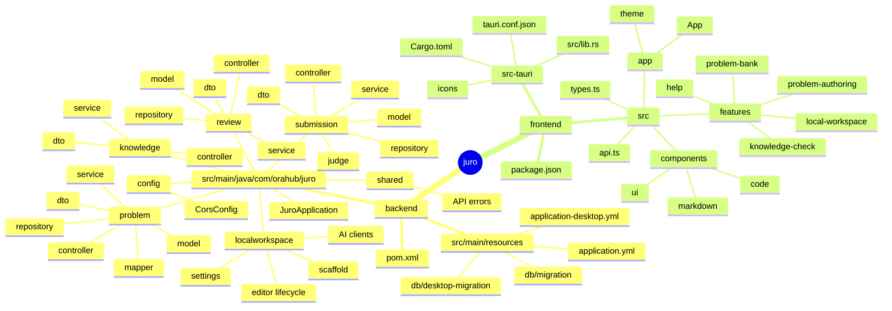

The project is organized by backend feature packages and frontend feature folders. Tauri owns the desktop process shell and launches the packaged backend.

## Component / Module Diagram

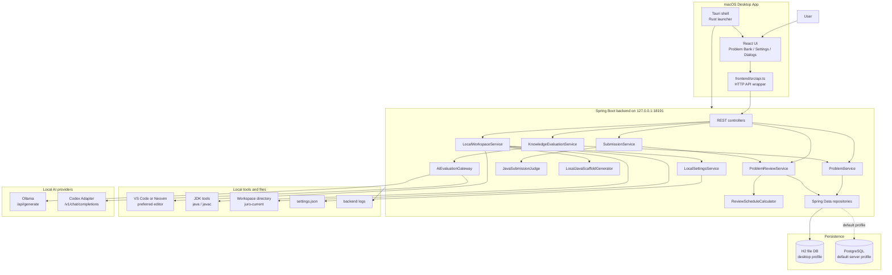

The backend is the boundary for persistence, local tooling, editor launch, Java execution, AI evaluation, and scheduling. The frontend keeps UI state and calls backend endpoints through one API wrapper.

## Deployment Diagram

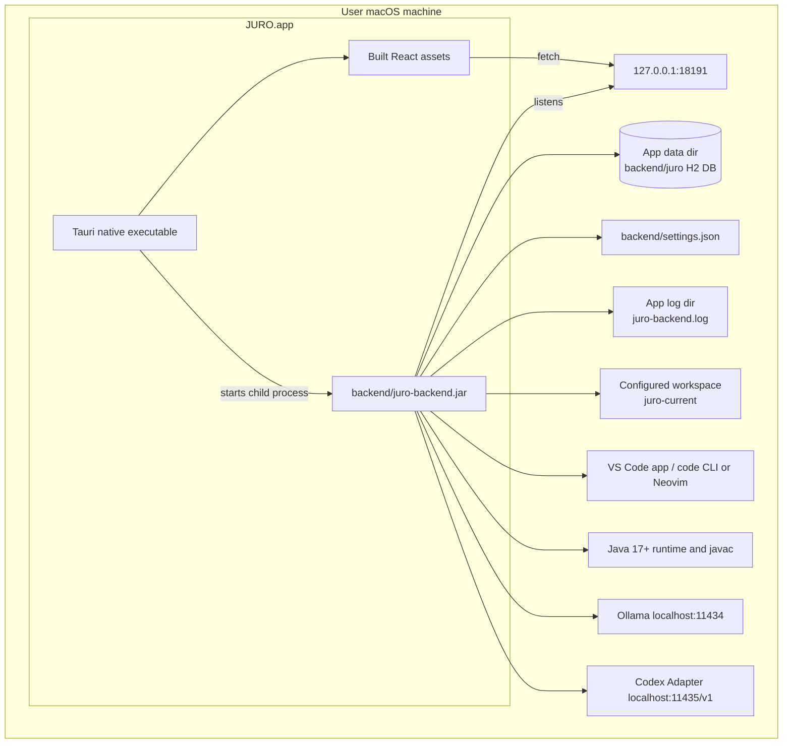

The production path is local desktop deployment. The app bundle includes frontend assets and the backend jar; local tools remain host dependencies.

## ERD

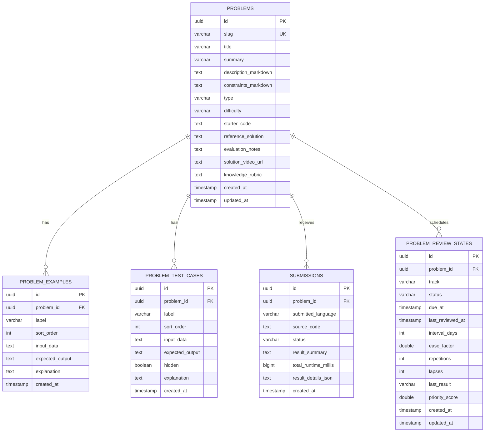

The database stores problem content, visible examples, runnable test cases, submission history, and two review states per problem: `CODING` and `EXPLANATION`.

## Backend Class / Service Diagram

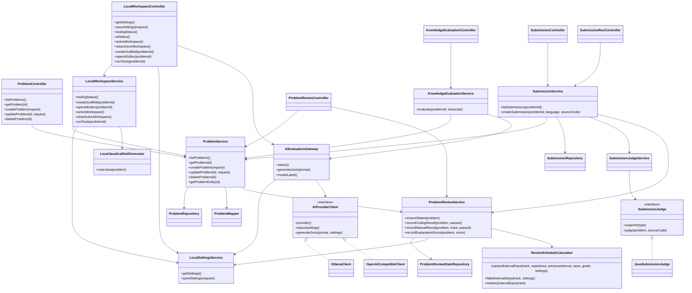

The backend is layered as controllers → services → repositories/integrations. Java judging and AI provider calls are strategy-style integrations behind service interfaces.

## Domain Class Diagram

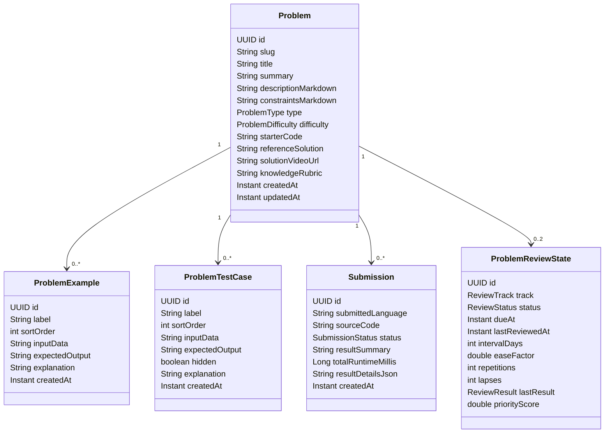

The current domain is Java-only at the application layer. The persisted `type` field remains a string enum, but services validate and filter for `JAVA`.

## Frontend Module Diagram

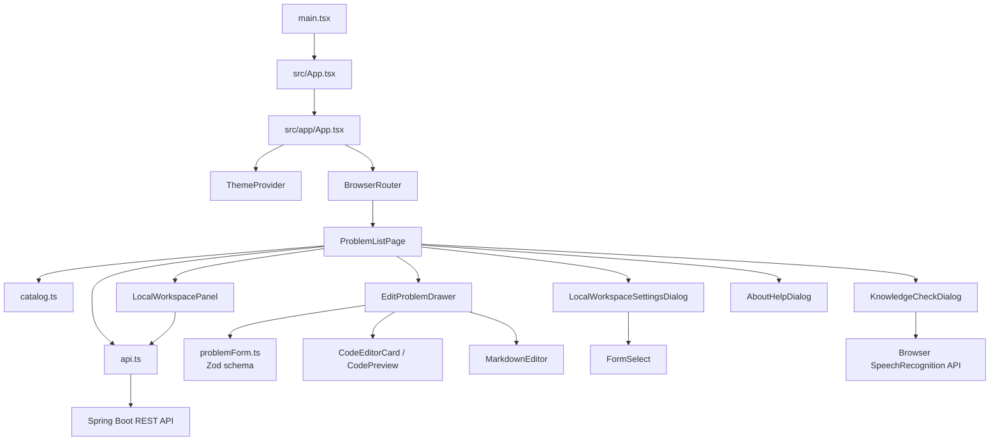

The only route renders `ProblemListPage`; modal and drawer state inside that page drives authoring, settings, current workspace, help, and knowledge-check UI.

## API Map

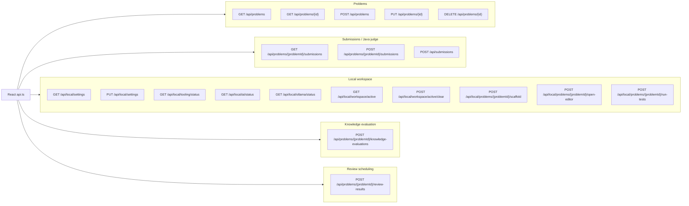

The frontend uses these endpoints through `frontend/src/api.ts`; no separate frontend API clients exist per feature.

## Sequence: Desktop App Startup

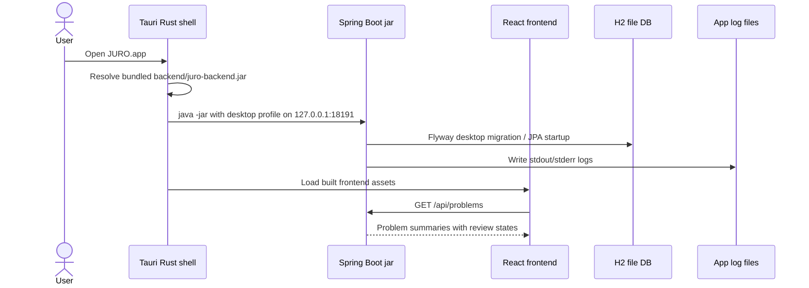

Tauri starts the backend as a child process and injects desktop settings such as `SPRING_PROFILES_ACTIVE=desktop`, `SERVER_PORT=18191`, and `JURO_DATA_DIR`.

## Sequence: Open Problem In Editor

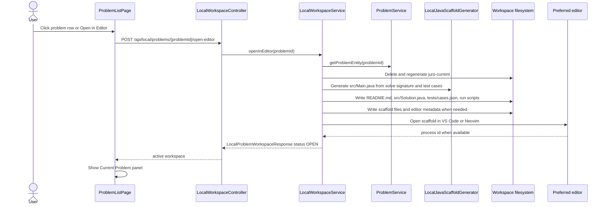

JURO isolates its VS Code workflow with a dedicated user-data directory under the JURO workspace metadata folder. Neovim opens the generated scaffold directly in a terminal.

## Sequence: Run Local Java Tests And Grade Coding

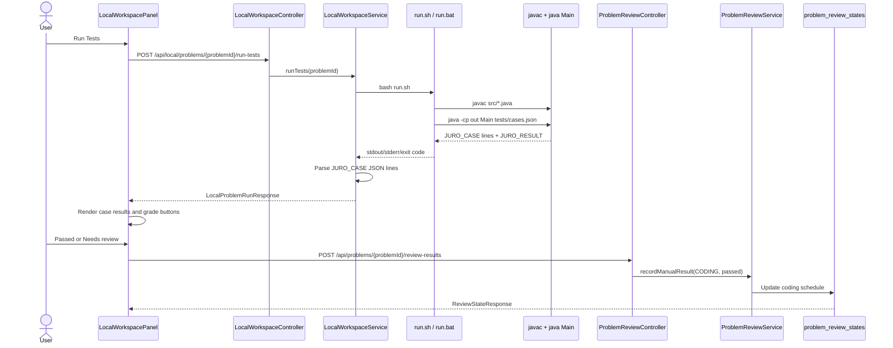

Local test execution does not automatically grade the review in the UI; the user marks the coding review based on the deterministic test output.

## Sequence: Knowledge Check With Local AI

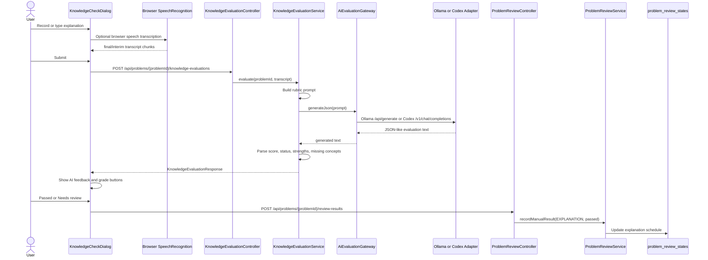

The AI gives feedback, but the frontend records the explanation review only after the user chooses the grade.

## Sequence: Create Or Edit Problem

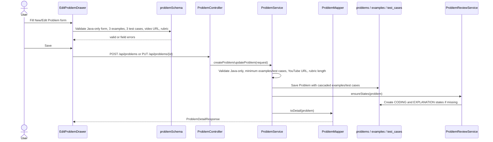

Frontend and backend both validate the same core constraints: Java-only, at least three examples, at least three runnable test cases, solution video, and knowledge rubric.

## Review Scheduling Flow

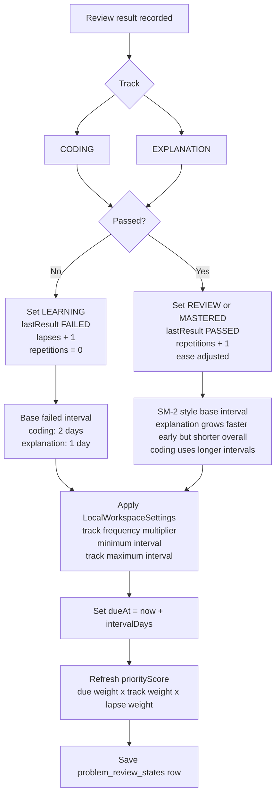

The scheduler uses the saved settings when a future review result is recorded; it does not recalculate every stored due date globally.

## Data Flow Diagram

```mermaid
flowchart LR
  ProblemAuthor[Problem authoring input] --> ProblemAPI[Problem API]
  ProblemAPI --> ProblemDB[(Problem tables)]
  ProblemDB --> ProblemBank[Problem Bank UI]

  ProblemBank --> EditorAPI[Open editor API]
  EditorAPI --> ScaffoldFiles[Local scaffold files<br/>README / Solution.java / Main.java / cases.json]
  ScaffoldFiles --> LocalEditor[Preferred editor]
  LocalEditor --> Solution[Edited Solution.java]
  Solution --> RunAPI[Run tests API]
  RunAPI --> JavaRun[javac + Main]
  JavaRun --> TestResult[Test result response]
  TestResult --> CodingGrade[User coding grade]
  CodingGrade --> ReviewDB[(Review state)]

  ProblemBank --> KnowledgeUI[Knowledge Check UI]
  KnowledgeUI --> Transcript[Transcript text]
  Transcript --> AiAPI[Knowledge evaluation API]
  AiAPI --> LocalAI[Ollama or Codex Adapter]
  LocalAI --> AiFeedback[Score and feedback]
  AiFeedback --> ExplanationGrade[User explanation grade]
  ExplanationGrade --> ReviewDB

  ReviewDB --> ProblemBank
```

Problem content, deterministic code results, AI feedback, and user grading converge into review state that drives Problem Bank ordering and status pills.
