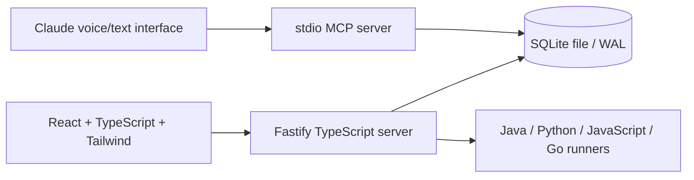
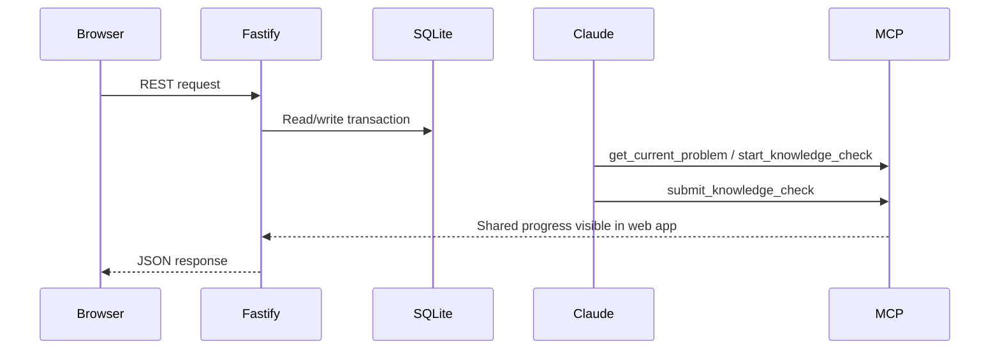

# Architecture diagrams

```mermaid
flowchart LR
  Browser[React + TypeScript + Tailwind] --> Web[Fastify TypeScript server]
  Web --> DB[(SQLite file / WAL)]
  Web --> Runners[Java / Python / JavaScript / Go runners]
  Claude[Claude voice/text interface] --> MCP[stdio MCP server]
  MCP --> DB
```

```mermaid
sequenceDiagram
  participant Browser
  participant Fastify
  participant SQLite
  participant Claude
  Browser->>Fastify: REST request
  Fastify->>SQLite: Read/write transaction
  Claude->>MCP: get_current_problem / start_knowledge_check
  Claude->>MCP: submit_knowledge_check
  MCP-->>Fastify: Shared progress visible in web app
  Fastify-->>Browser: JSON response
```

The compiled frontend is served by Fastify from the same origin in production. During development, Vite proxies `/api` to the Fastify server.
